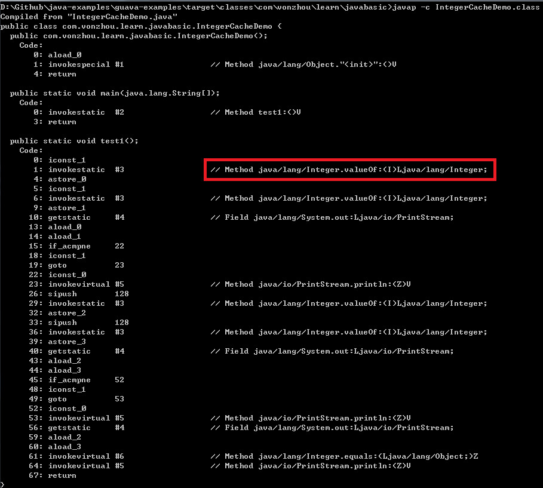

# 关于IntegerCache


对于可能犯错的地方要做到心中有数。

```java
public static void test1() {
    Integer a = 1; // 等价于 Integer a = valueOf(1)
    Integer b = 1;
    System.out.println(a == b); // true

    Integer c = 128;
    Integer d = 128;
    System.out.println(c == d); // false

    System.out.println(c.equals(d)); // true
}
```

把整数常量赋值给整数包装类型，实际上调用了Integer.valueOf方法，通过指令也可以看到：




```java
public static Integer valueOf(int i) {
    if (i >= IntegerCache.low && i <= IntegerCache.high)
        return IntegerCache.cache[i + (-IntegerCache.low)];
    return new Integer(i);
}
```

可以看到在[low, hight]范围内的数值会使用Integer缓存对象，否则新生成一个Integer对象，其中low=-128, hight可以通过系统属性进行配置，从内部类IntegerCache的实现可以理解。

```java
/**
 * Cache to support the object identity semantics of autoboxing for values between
 * -128 and 127 (inclusive) as required by JLS.
 *
 * The cache is initialized on first usage.  The size of the cache
 * may be controlled by the {@code -XX:AutoBoxCacheMax=<size>} option.
 * During VM initialization, java.lang.Integer.IntegerCache.high property
 * may be set and saved in the private system properties in the
 * sun.misc.VM class.
 */
 
private static class IntegerCache {
    static final int low = -128;
    static final int high;
    static final Integer cache[];

    static {
        // high value may be configured by property
        int h = 127;
        String integerCacheHighPropValue =
            sun.misc.VM.getSavedProperty("java.lang.Integer.IntegerCache.high");
        if (integerCacheHighPropValue != null) {
            try {
                int i = parseInt(integerCacheHighPropValue);
                i = Math.max(i, 127);
                // Maximum array size is Integer.MAX_VALUE
                h = Math.min(i, Integer.MAX_VALUE - (-low) -1);
            } catch( NumberFormatException nfe) {
                // If the property cannot be parsed into an int, ignore it.
            }
        }
        high = h;

        cache = new Integer[(high - low) + 1];
        int j = low;
        for(int k = 0; k < cache.length; k++)
            cache[k] = new Integer(j++);

        // range [-128, 127] must be interned (JLS7 5.1.7)
        assert IntegerCache.high >= 127;
    }

    private IntegerCache() {}
}
```

所以在进行Integer对象相等性比较的时候，不能直接使用 == (比较的是对象的hashcode，只有[low,high]之间的Integer是相同的), 而应该使用equals方法。

```java
public boolean equals(Object obj) {
    if (obj instanceof Integer) {
        return value == ((Integer)obj).intValue();
    }
    return false;
}
```


## 总结

* 普通对象（包括包装类型）的相等性使用equals方法

