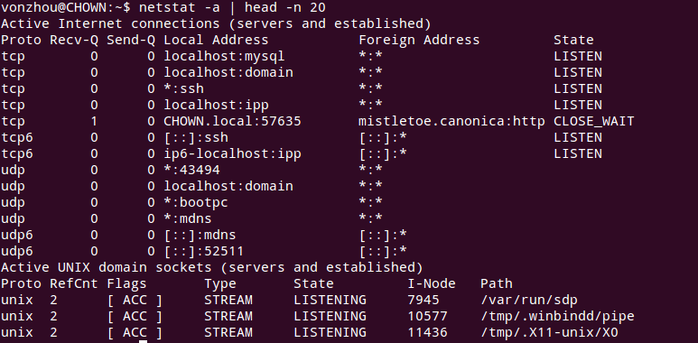
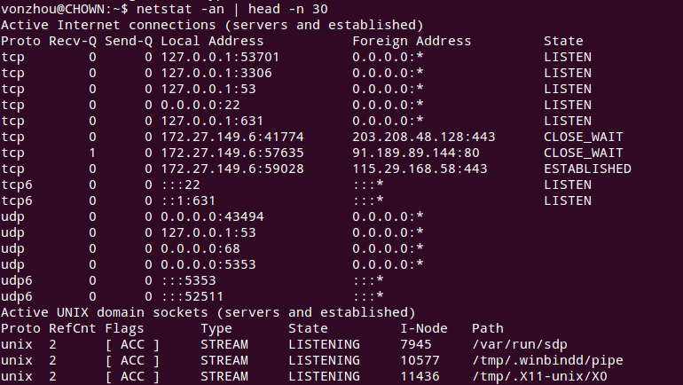
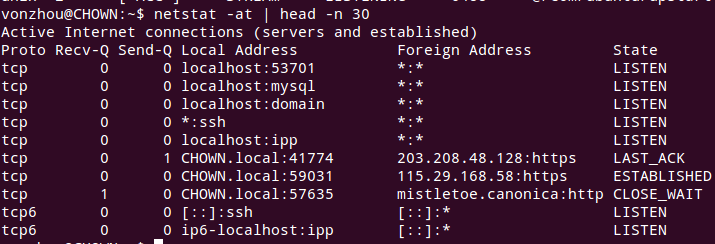
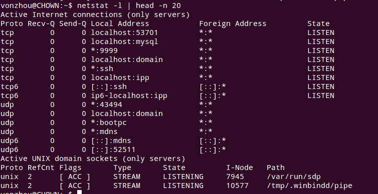
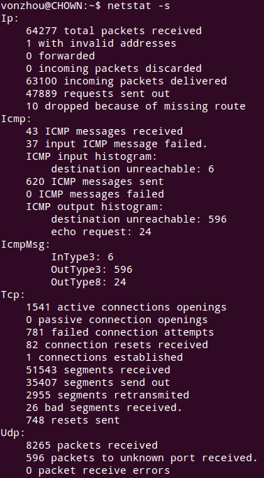
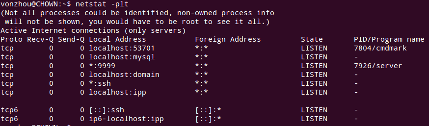
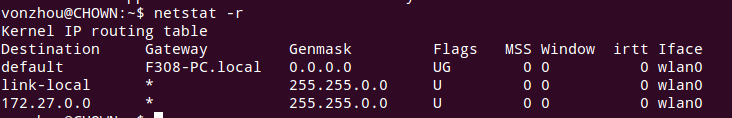
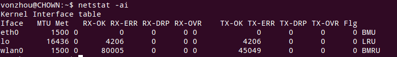
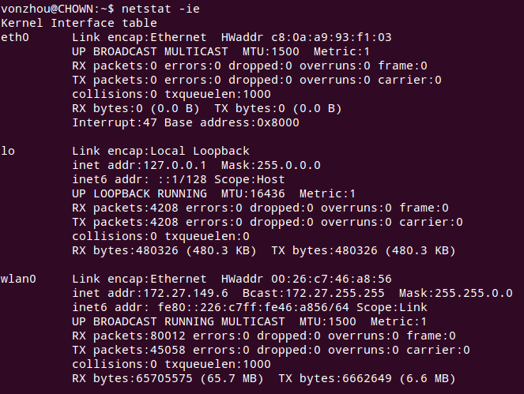

# netstat 常用命令整理

---

-a 列出所有的端口(不论是否在监听),协议，地址4元组，状态。

-n 能够把主机和服务名称显示为具体的数字形式。

-t , -u 分别显示TCP，UDP的连接状态。

-l 列出处于listen状态的socket。

-lt, -lu, -lx 则分别对应TCP， UDP，Unix domain处于listen状态的套接字。

-s 列出每种协议的统计数据（statistics）, -st,-su则对应过滤TCP/UDP。

-p 选项和其他选项结合，能够显示出对应的程序和PID。

-r 显示路由信息。

-i 显示网络端口。

-ie 加上-e会显示额外的信息（extended info）, 和ifconfig类似。

