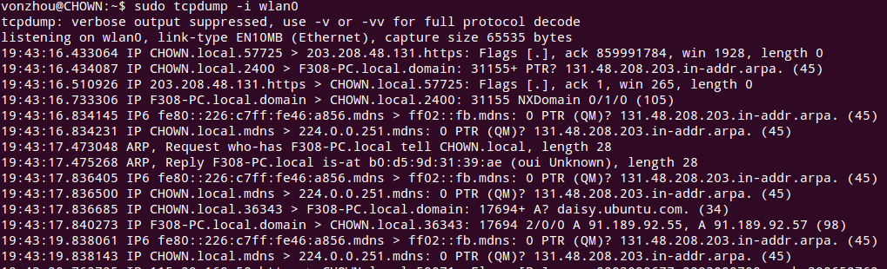
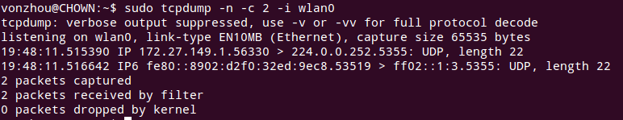
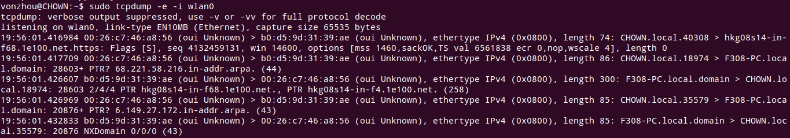
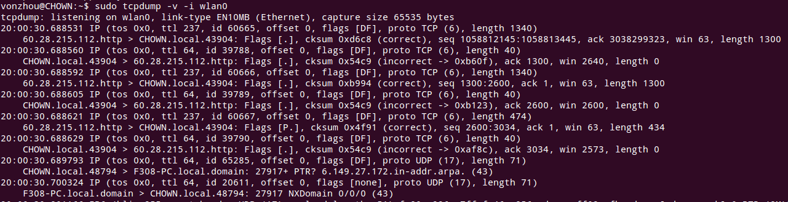
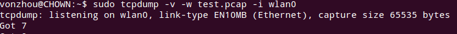
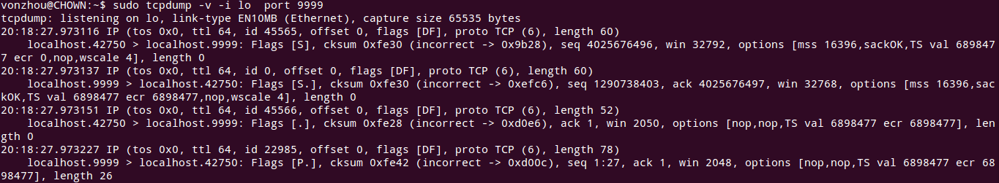

# tcpdump 常用命令整理
---

tcpdump使用libpcap库，在网络层实现抓包，然后可以供我们分析。

-i 指定在某个interface进行抓包。

-n 数字形式展示主机和服务端口。

-c 指定抓包的数目。

-s 可以设置抓取包的大小，-s0则表示capture the whole packet.

-e 可以显示MAC地址，协议类型。

-v 会得到详细（verbose）信息（v,vv,vvv逐渐增多）.

-S 显示TCP的绝对序列号，而不是相对于初始序列号(ISN的相对值。

-w 用于指定文件存储抓取的包。

-r 用于读取我们刚才保存的文件。

port XX 指定具体的端口。

在网络程序的调试中要善于利用上述选项的组合进行分析！

